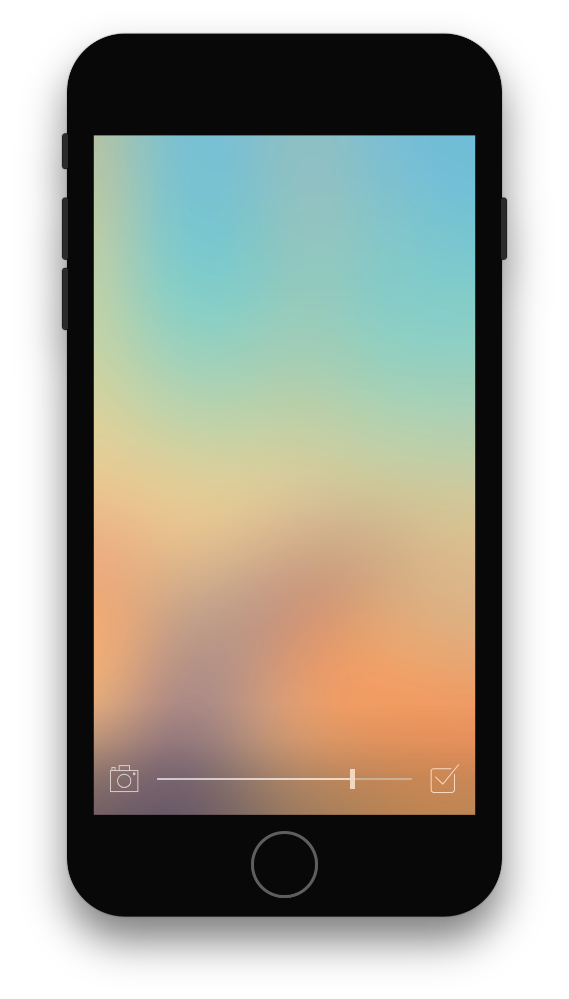

	
	<h1>Blear</h1>
	<h5>Transform your photos into stunning blurry wallpapers on your iOS device</h4>
	 
	<h4>
		<a href="https://sindresorhus.com/blear">Website</a>
		&nbsp;&nbsp;&nbsp;
		<a href="https://itunes.apple.com/app/blear-create-blurry-wallpapers/id994182280">App Store</a>
	</h4>

 
 
 

## Info

Requires minimum iOS 12.

## Dev

Make sure to open `Blear.xcworkspace`, not `Blear.xcodeproj`.

## License

MIT © [Sindre Sorhus](https://sindresorhus.com)
